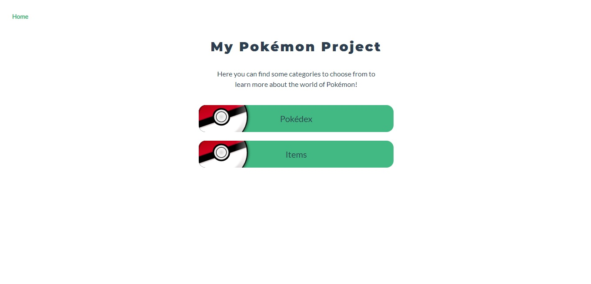
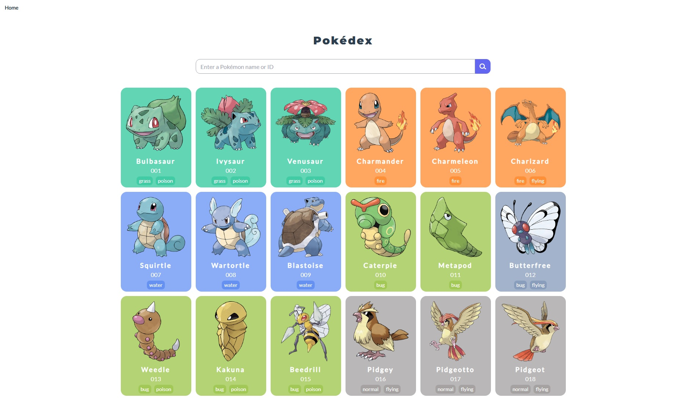
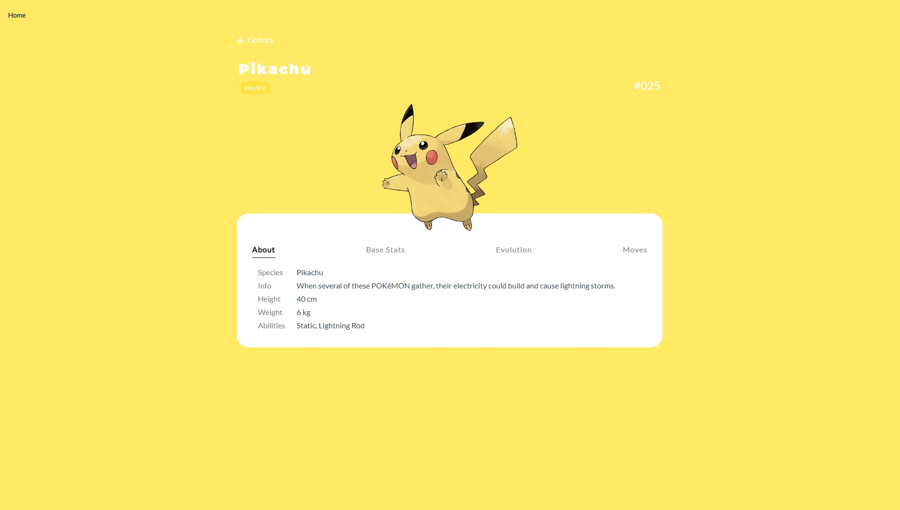
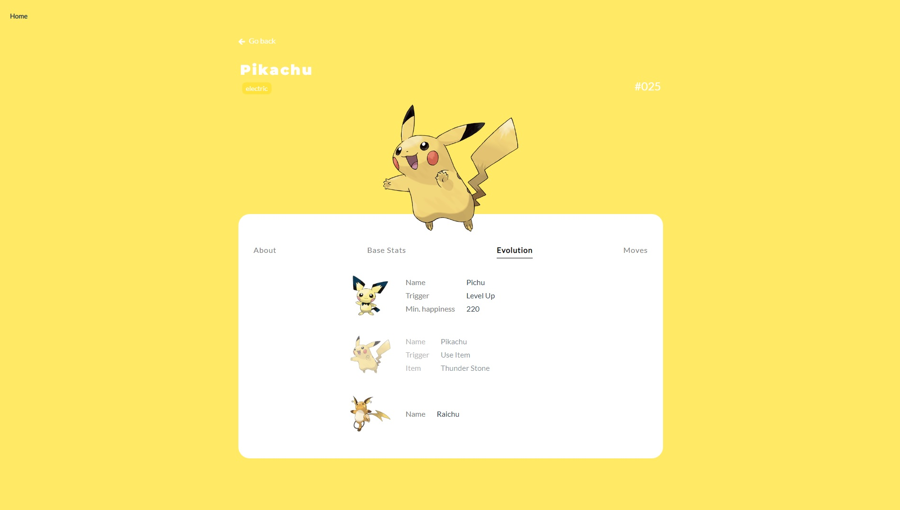
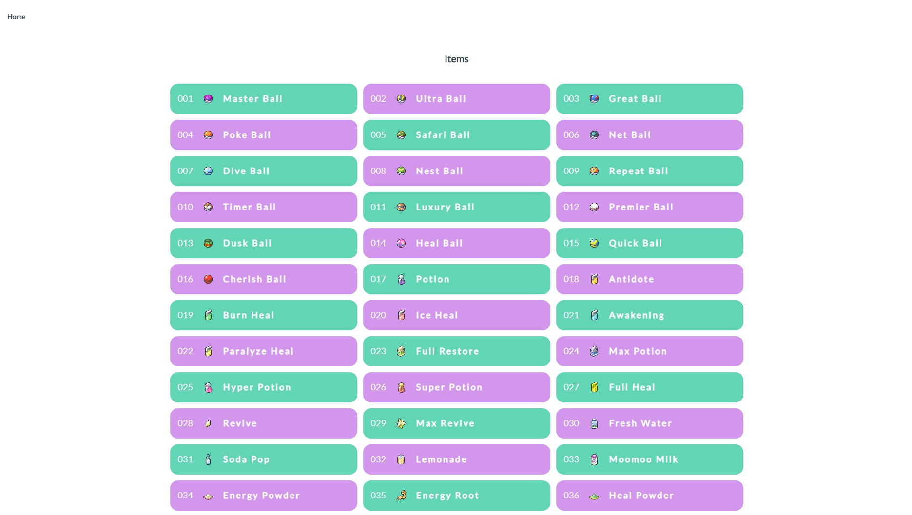
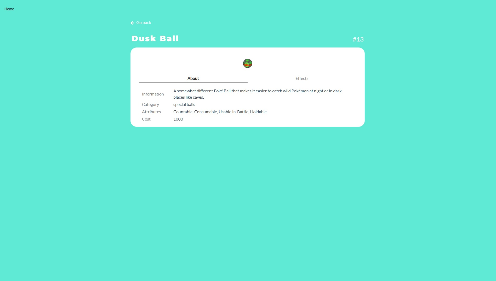

# My_Pokemon

<br/>


<br/>

## :scroll: Project description

PokéAPI powered Vue app with information about the world of Pokémon.
The app allows you to get to know each Pokémon in detail. From the application's main menu, select ‘pokedex’ to access a list of all pokemon. We are shown a list of the first 40 Pokémon, subsequent ones will be displayed as we scroll the page. Once you have selected a Pokémon, you will see its detailed description, its statistics, its evolution and a list of the episodes in which it appeared. 


## :hammer_and_pick: Built With

- Vue
- JavaScript
- SCSS
- TailwindCSS
- [PokéApi](https://pokeapi.co/)

<br/>








## Project setup

```
npm install
```

### Compiles and hot-reloads for development

```
npm run dev
```

### Compiles and minifies for production

```
npm run build
```

- Vue
- JavaScript
- SCSS
- Tailwind CSS
- [PokéApi](https://pokeapi.co/)

<br/>

## :clap: Acknowledgments

- Icons: https://freesvg.org/

- Design inspired by: [Pokédex App](https://dribbble.com/shots/6540871-Pokedex-App/attachments/6540871-Pokedex-App?mode=media), [Mobile Pokédex App - Design Exploration](https://dribbble.com/shots/16833947-Mobile-Pokedex-App-Design-Exploration?utm_source=Clipboard_Shot&utm_campaign=sulistryono&utm_content=Mobile%20Pokedex%20App%20-%20Design%20Exploration&utm_medium=Social_Share&utm_source=Clipboard_Shot&utm_campaign=sulistryono&utm_content=Mobile%20Pokedex%20App%20-%20Design%20Exploration&utm_medium=Social_Share)